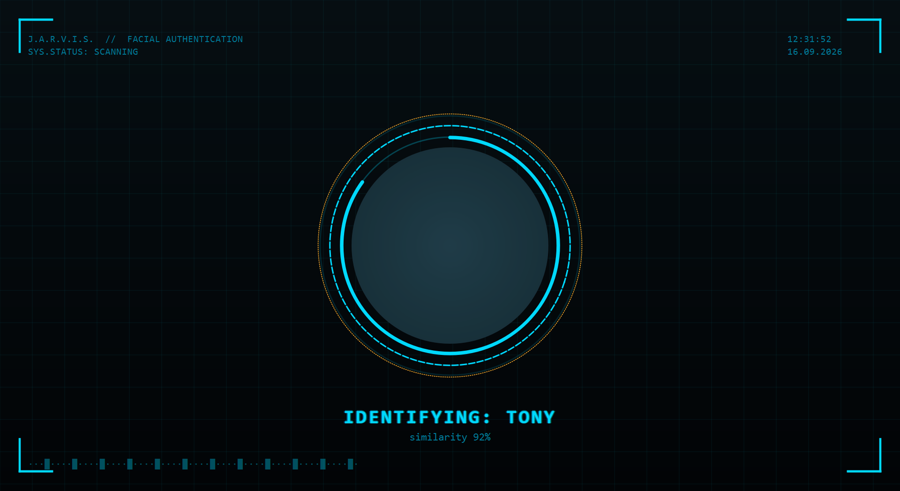
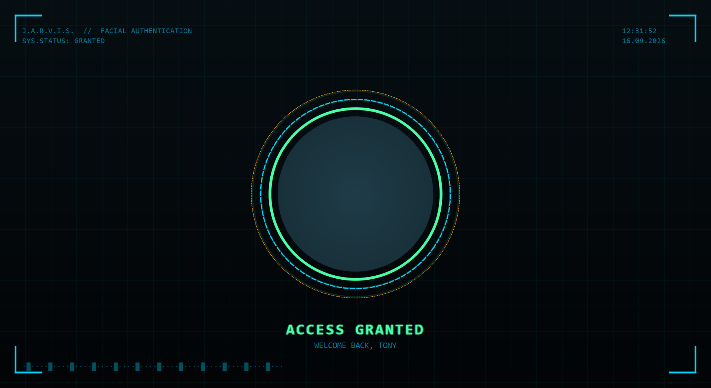

# FaceLock — J.A.R.V.I.S.-style Face Lock

A local desktop app: a full-screen, Iron Man/J.A.R.V.I.S.-styled HUD that uses your
webcam to recognize your face and unlock, instead of typing a password every time.

<p align="center">
  
  
</p>

**Important — what this actually does:** Windows' real sign-in screen runs on a
protected "Secure Desktop" that outside apps can't inject input into, so this does
**not** replace Windows login. Instead it's your own lock screen: trigger it whenever
you step away, and it locks your view until your face (or a backup PIN) is verified.
Everything runs locally — no cloud calls, no telemetry. Face data lives only in
`%LOCALAPPDATA%\FaceLock` on your machine.

## Features

- Full-screen animated HUD — rotating arc-reactor viewport, glow rings, scan lines,
  HUD brackets and readouts
- Face recognition via OpenCV's **YuNet** detector + **SFace** embeddings (a real
  deep-learning face recognizer, not a simple texture match — it actively rejects
  faces that were never enrolled)
- **Liveness check** — requires natural head micro-movement before granting, so a
  static printed photo held up to the camera won't unlock it
- **PIN fallback** if the camera can't recognize you — you're never locked out
- **Multiple profiles** — enroll more than one person from the tray menu
- **Manage Profiles** dialog to view/delete enrolled faces
- **Access log** — local timestamped history of every grant/deny, face or PIN
- **Failed-attempt alerts** — a tray warning + saved snapshot after repeated denials
- **Auto-lock when idle** — locks itself after N minutes of no keyboard/mouse input
- **Auto-lock when you leave** — locks itself if your face hasn't been seen by the
  webcam for a while (independent of keyboard/mouse activity)
- **Voice feedback** — JARVIS-style "Access granted, welcome back" on unlock
- Global hotkey (`Ctrl+Alt+L`) + system tray, with an optional "Start with Windows"

## Running it

Double-click **`Run FaceLock.bat`** — it starts silently in the system tray (bottom-right,
arc-reactor icon). First run launches the enrollment wizard automatically.

Tray icon → right-click for the full menu:
- **Lock Now** (or press `Ctrl+Alt+L` anywhere) — show the lock HUD immediately
- **Enroll / Re-scan Face...** — add a new face profile, or retrain your own
- **Manage Profiles...** — view/delete enrolled faces
- **Set Backup PIN...** — change the fallback PIN (press `P` on the lock screen to use it)
- **View Access Log...** — recent grant/deny history
- **Auto-lock when idle** / **Auto-lock when you leave** / **Voice feedback** — checkboxes
- **Start with Windows** — launch automatically at login

## How unlocking works

The HUD scans continuously; once your face is confidently matched for enough
consecutive frames *and* shows natural liveness movement, it shows "ACCESS GRANTED"
and dismisses itself. If the camera can't recognize you (bad lighting, camera off,
etc.) press **P** on the lock screen and enter your backup PIN instead.

## Notes / limitations

- This is a convenience layer, not a substitute for real OS security. The liveness
  check raises the bar against a printed photo but isn't foolproof — don't rely on
  this to protect anything highly sensitive. The PIN is stored as a salted hash.
- Anyone you enroll gets full access, same as you — there's no restricted tier.
- The default hotkey is `Ctrl+Alt+L` (see `facelock/config.py` → `GLOBAL_HOTKEY`) —
  change it there if it collides with another app you use.
- Only covers your primary monitor.
- "Auto-lock when you leave" keeps the webcam active at low frequency while unlocked
  and this feature is on — it's opt-in (off by default) for that reason.

## Manual setup (if you ever need to reinstall)

```
python -m venv venv
venv\Scripts\pip install -r requirements.txt
venv\Scripts\python main.py
```
